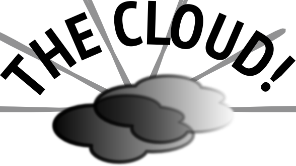
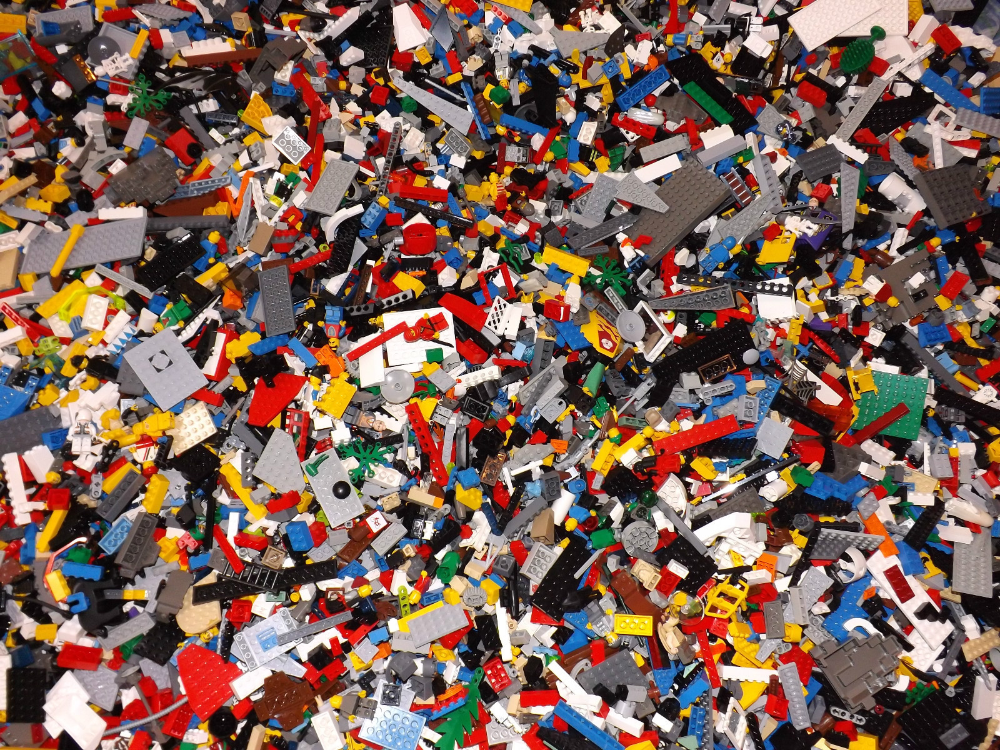
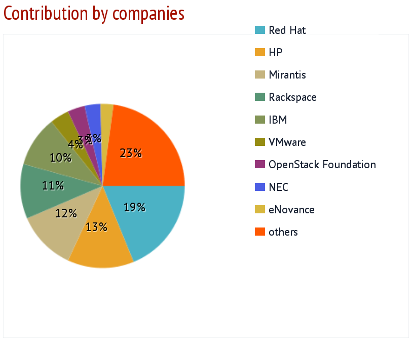
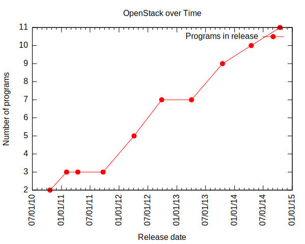
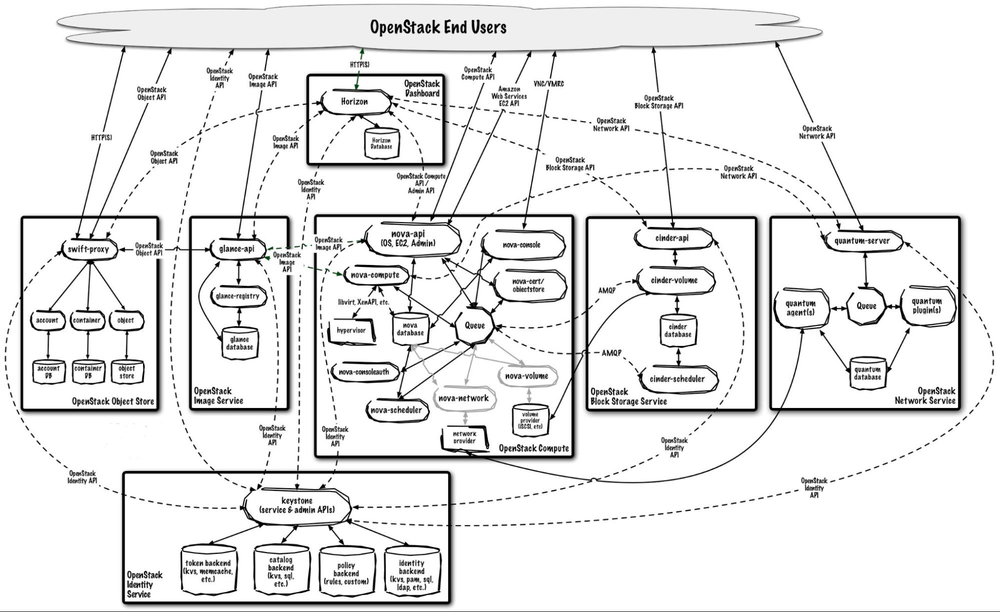

# OpenStack Overview

September 10, 2014  
Lars Kellogg-Stedman <lars@redhat.com>  

---

# What is OpenStack?

---

OpenStack is exciting!

---

It's up to you to put it together.

---

# What is OpenStack?

---

- "Infrastructure as a Service" (IaaS)
- A resource scheduler for your infrastructure
- A way to make more effective use of hardware resources

---

- A fundamental shift in how we manage infrastructure

---

## What OpenStack is not...

- A virtualization platform
- Freedom from Infrastructure
- Mature

---

## Development model

- Community developed
- Vendors and individuals
- Formal [code-review process][1]
- Six-month release schedule

[1]: https://wiki.openstack.org/wiki/Gerrit_Workflow

---

(from [Stackalytics][1])

[1]: http://stackalytics.com/

---

## Core projects

(As of Icehouse)

- [Ceilometer][] (Telemetry)
- [Cinder][] (Block Storage)
- [Glance][] (Image Service)
- [Heat][] (Orchestration)
- [Horizon][] (Dashboard)
- [Keystone][] (Identity)
- [Neutron][] (Networking)
- [Nova][] (Compute)
- [Swift][] (Object Storage)
- [Trove][] (Database Service)

[Ceilometer]: https://wiki.openstack.org/wiki/Ceilometer
[Cinder]: https://wiki.openstack.org/wiki/Cinder
[Glance]: https://wiki.openstack.org/wiki/Glance
[Heat]: https://wiki.openstack.org/wiki/Heat
[Horizon]: https://wiki.openstack.org/wiki/Horizon
[Keystone]: https://wiki.openstack.org/wiki/Keystone
[Neutron]: https://wiki.openstack.org/wiki/Neutron
[Nova]: https://wiki.openstack.org/wiki/Nova
[Swift]: https://wiki.openstack.org/wiki/Swift
[Trove]: https://wiki.openstack.org/wiki/Trove

<!-- .element: class="twocolumn" -->

---

## Accretion

---

You thought I was kidding with that lego slide, didn't you?

---

# Keystone

---

# Nova

---

# Glance

---

# Cinder

---

# Neutron

---

# Swift

---

# Ceilometer

---

# Heat

---

# Horizon

---

